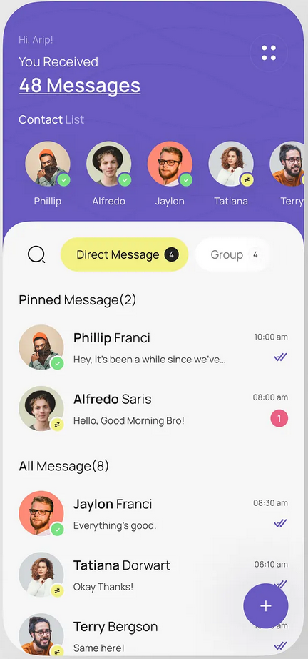

# Welcome to Chat

This project contains **one React Native screen** created as a UI practice exercise. The goal is to build a clean and reusable **User List Item** component similar to a chat application's conversation list (WhatsApp, Messenger, etc.).



---

## Features

- Circular **avatar** image on the left  
- Vertical text block (username + last message)  
- Right-aligned **badge** that shows either:
  - A **red unread count**, or  
  - **Two blue ticks** for read messages  
- Fully **reusable** `<UserListItem />` component  
- Simple clean layout using `flexDirection: "row"` etc.

---

## Components Structure

```
/components
  ├── Avatar.tsx
  ├── Badge.tsx
  └── UserListItem.tsx
  └── HeaderRow.tsx
  └── CardSection.tsx
  └── ContactList.tsx
  └── DirectMessageButton.tsx
  └── AllMessagesSection.tsx
  └── PinnedMessagesButton.tsx
```

---

## Some Component Responsibilities

### **Avatar**
- Displays a profile image in a circular shape.
- Accepts a `size` prop and `source`.

### **Badge**
Shows status on the right side:
- Red unread message count  
- OR two blue ticks (read status)

### **UserListItem**
The main row layout:
- Avatar on the left  
- Username + message in middle  
- Badge on the right  
- Entire row wrapped in a `TouchableOpacity` (optional)

---

## How to Run

1. Install dependencies:
   ```
   npm install
   ```
2. Start the project:
   ```
   npx expo start
   ```

---

## Purpose

This is **not a full app**, but a **UI-focused practice exercise** to improve React Native skills:
- Layout design  
- Component reusability  
- Props handling  
- Aligning items in rows  
---

### Done  
A clean and simple one-screen React Native UI exercise.
